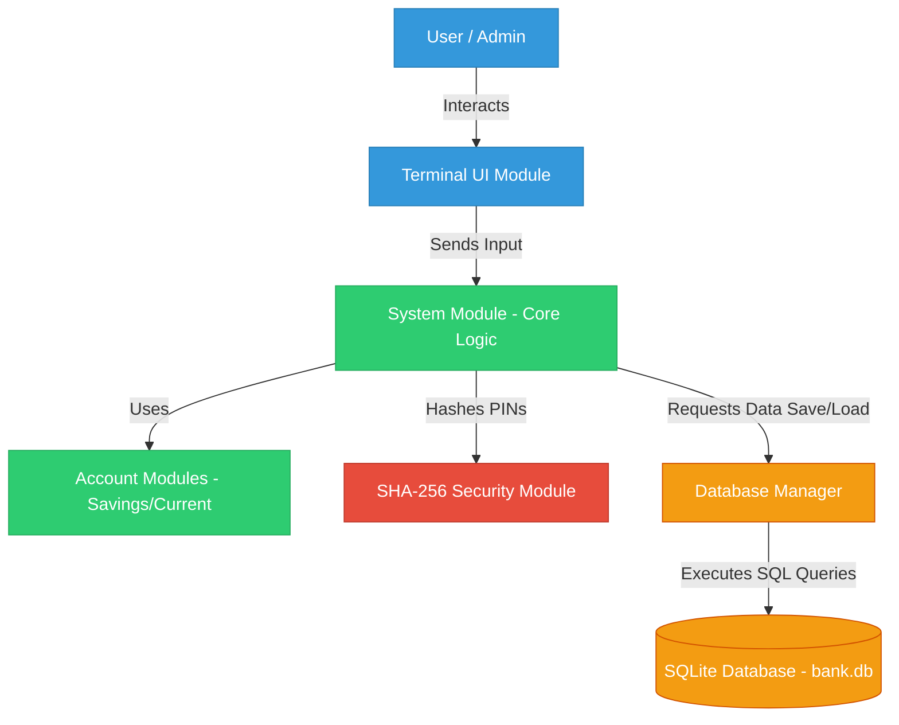

# Advanced ATM Simulator - Architecture Overview

## Introduction
The ATM Simulator is a robust, object-oriented C++ application designed to simulate real-world banking operations. It bridges the gap between low-level terminal interfaces and high-level database management by using a local SQLite database and cryptographic security.

## Three-Tier Architecture
The project follows a simplified **Three-Tier Architecture** pattern to separate concerns, making the code highly modular and easy to maintain.

### 1. Presentation Layer (UI)
- **File:** `UI.cpp`, `UI.h`
- **Purpose:** Handles all interactions with the user. It uses ANSI escape sequences and ASCII box drawing to present a beautiful, colorful, and error-proof command-line interface. It ensures that bad user input (like typing letters instead of numbers) is caught gracefully without crashing the system.

### 2. Business Logic Layer (System & Accounts)
- **Files:** `System.cpp`, `Account.cpp`, `sha256.cpp`
- **Purpose:** The core brain of the application. 
  - The `System` class manages the state of the application (who is logged in, navigating menus).
  - The `Account` hierarchy manages banking rules. Using **Polymorphism**, the system differentiates between `SavingsAccount` (which prevents going into negative balance) and `CurrentAccount` (which allows a $500 overdraft).
  - The `SHA256` module handles security. Before a PIN is sent to the database, it is irreversibly hashed.

### 3. Data Access Layer (DatabaseManager)
- **Files:** `DatabaseManager.cpp`, `sqlite3.c`
- **Purpose:** Completely isolates the database operations from the business logic. The `DatabaseManager` translates C++ objects into SQL queries (`INSERT`, `SELECT`, `UPDATE`) and communicates with the bundled SQLite C-engine. This layer ensures that data persistence is handled securely and efficiently in `bank.db`.

## Key Architectural Decisions
1. **SQLite Amalgamation:** Instead of requiring a separate MySQL server, the SQLite engine is compiled *directly* into the executable. This makes the software highly portable and "plug-and-play".
2. **Abstract Base Classes:** The `Account` class is abstract. This enforces the rule that a user cannot have a generic account; it must be a specific type (Savings or Current).
3. **Transaction Logging:** Instead of just updating a balance, every financial movement generates a unique transaction record in a separate SQL table, mimicking a real bank's ledger.
