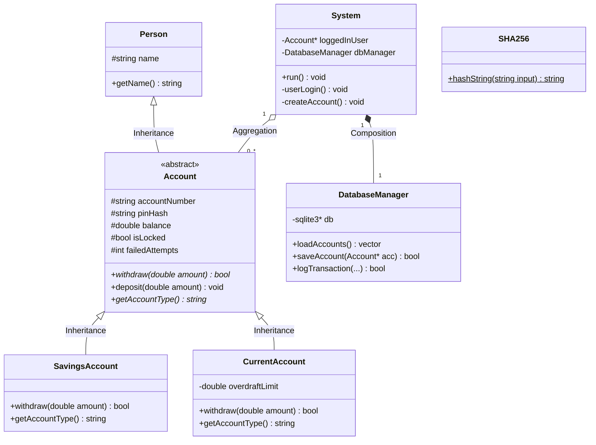

# Class Diagram and OOP Design

This document explains the Object-Oriented Programming (OOP) design of the system. You can use the Mermaid diagram below to visualize the relationships between the classes.

## Class Diagram

## How OOP is Used Here (For Interviewers)

1. **Inheritance**: `Account` inherits from `Person` (an account belongs to a person). `SavingsAccount` and `CurrentAccount` inherit from `Account`.
2. **Encapsulation**: Sensitive fields like `balance` and `pinHash` are hidden (`protected`/`private`). They can only be modified safely through methods like `deposit()` and `withdraw()`.
3. **Abstraction**: `Account` is an abstract class (it has pure virtual functions). You cannot create a direct instance of `Account`. `DatabaseManager` abstracts away all the complex SQL logic from the main `System`.
4. **Polymorphism**: The `withdraw()` function is polymorphic. If the user has a `SavingsAccount`, `withdraw()` ensures the balance doesn't drop below 0. If they have a `CurrentAccount`, the *same function call* behaves differently, allowing the balance to drop to -$500.
