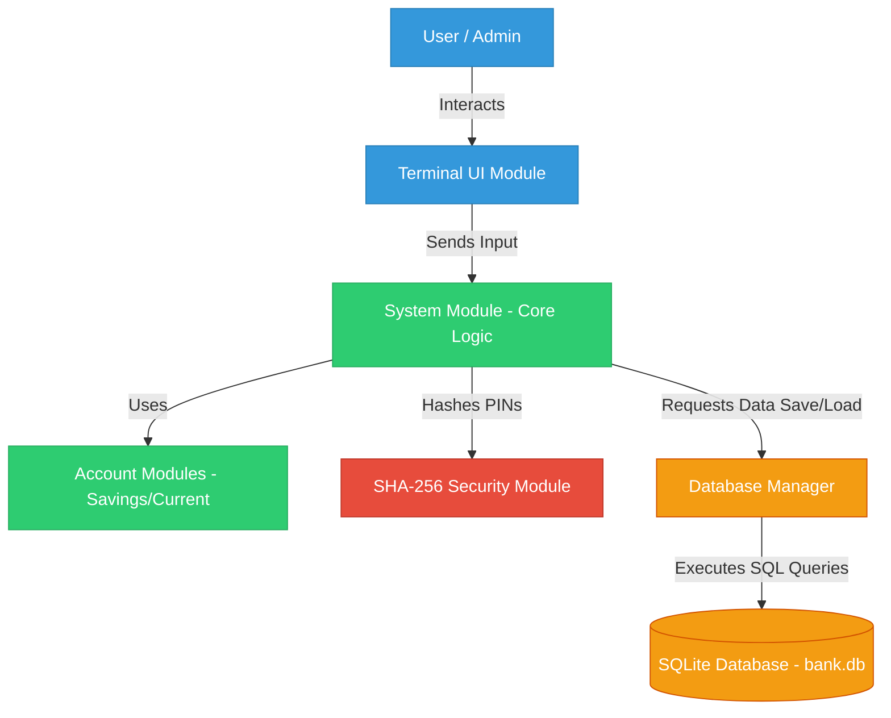
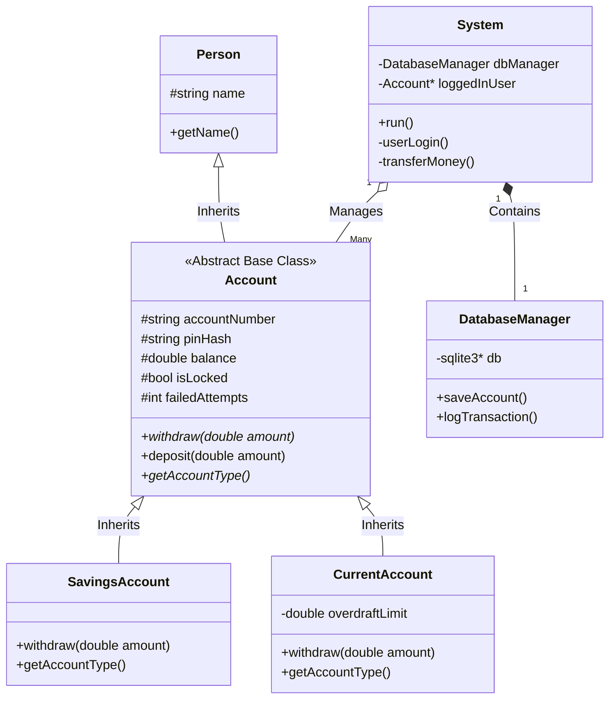
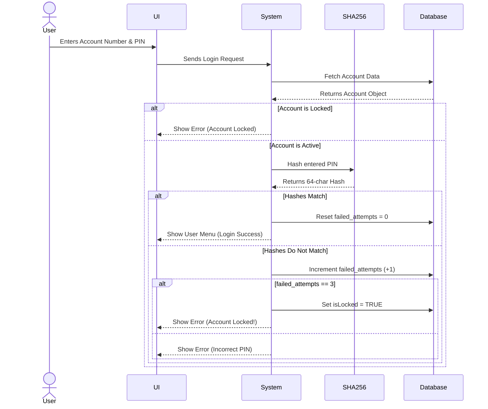
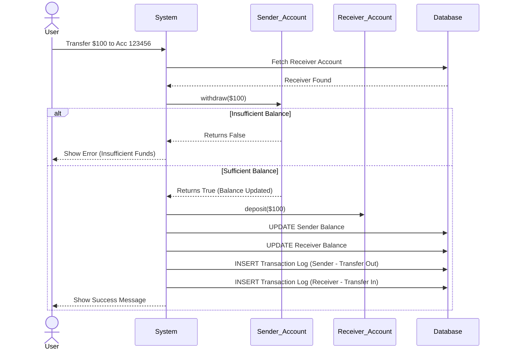
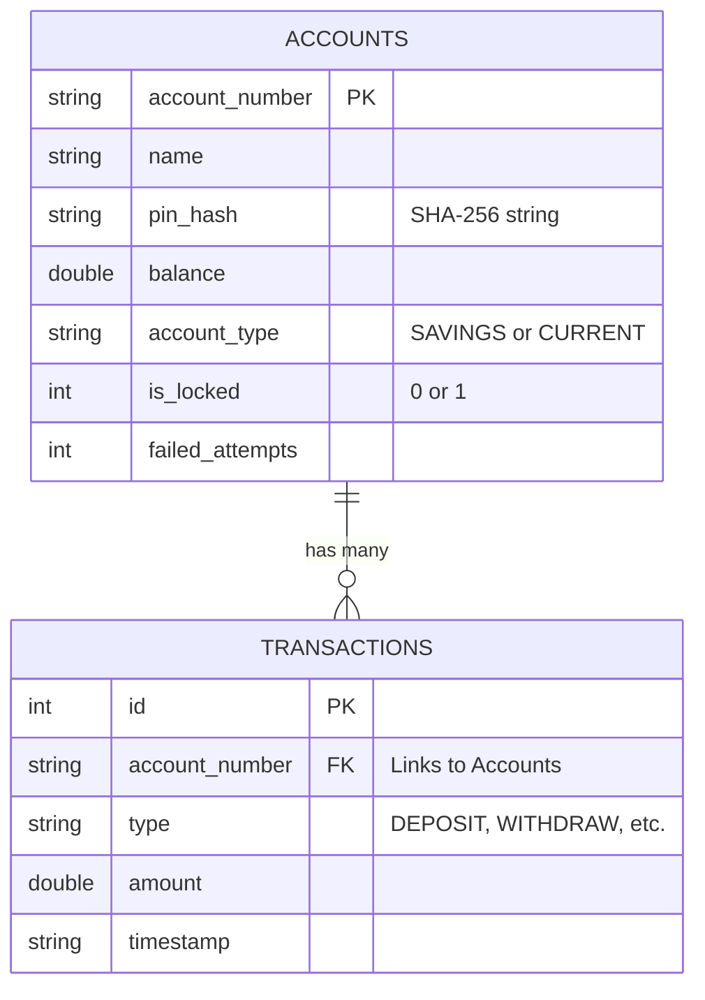

# ATM Simulator - Master Visual Guide

This document contains visual diagrams mapping out the entire architecture, class relationships, logic flows, and database structure of the ATM Simulator. You can use these diagrams to easily explain how the system works to your professor, interviewer, or teammates.

*(Note: These diagrams use Mermaid.js syntax. GitHub will automatically render them into beautiful images when viewed in your repository.)*

---

## 1. High-Level Architecture Diagram
This shows how the different modules of the system connect. The User interacts with the UI, which talks to the System logic, which securely hashes data and talks to the Database Manager to save it.

---

## 2. Complete Class Diagram (Object-Oriented Design)
This diagram proves your knowledge of OOP. It shows Inheritance (arrows with hollow triangles) and Abstraction (italicized abstract classes).

---

## 3. User Login & Security Flow (Sequence Diagram)
This step-by-step sequence diagram explains exactly what happens in the background when a user tries to log in. It highlights the 3-strike locking system and the SHA-256 hashing.

---

## 4. Money Transfer Flow
This diagram explains how the system ensures money is transferred safely between two accounts, updating the balances and logging the transaction history.

---

## 5. Database Schema (Entity-Relationship Diagram)
This shows the structure of your SQLite database tables.

