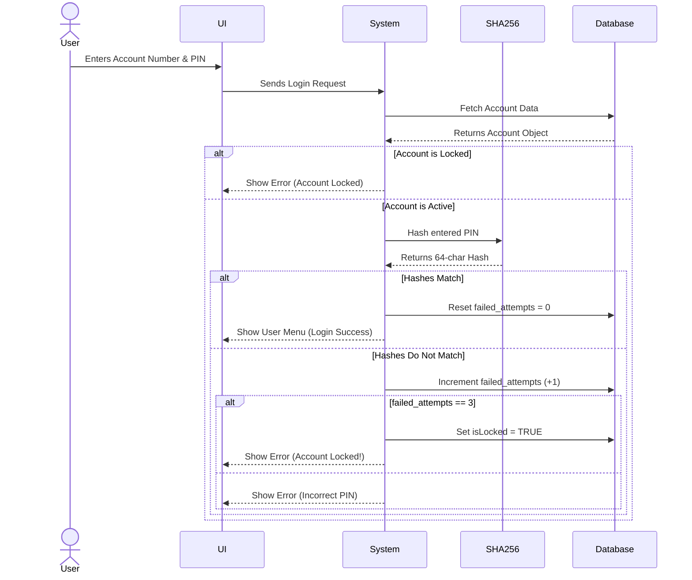
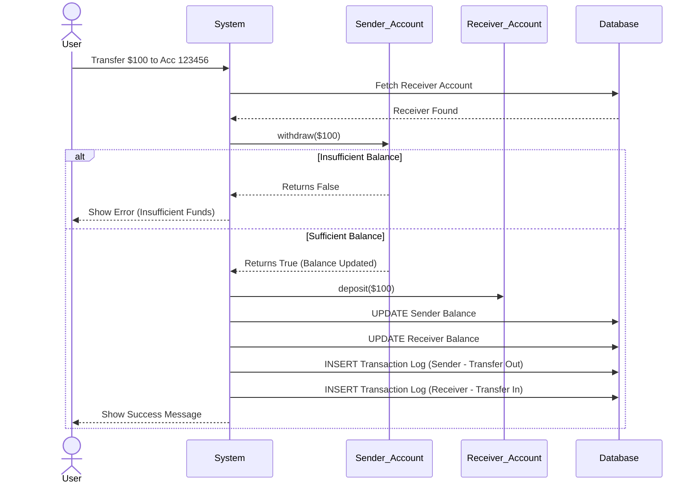

# System Flow and Data Journey

This document explains exactly how data moves through the application when a user performs an action.

## Flow 1: Creating an Account

1. **User Input**: The user selects "Create Account" in the UI and types their name, PIN, and initial deposit. They also choose "Savings" or "Current".
2. **Security**: The `System` passes the plain-text PIN to the `SHA256` class. `SHA256` returns a 64-character encrypted hash.
3. **Object Creation**: The `System` creates a new C++ object (either `SavingsAccount` or `CurrentAccount`) in memory.
4. **Database Storage**: The `System` passes this object to `DatabaseManager::saveAccount()`.
5. **SQL Execution**: The `DatabaseManager` constructs an `INSERT INTO Accounts` SQL query and executes it against `bank.db`.
6. **Transaction Log**: An "INITIAL DEPOSIT" transaction is logged in the `Transactions` table.

---

## Flow 2: User Login and Locking Mechanism

1. **Authentication**: User enters their Account Number and PIN.
2. **Verification**: 
   - The system fetches the account from memory.
   - It hashes the entered PIN using `SHA256`.
   - It compares the *new* hash with the *stored* hash.
3. **Success**: If they match, `failed_attempts` resets to 0. `loggedInUser` pointer is set, and the User Menu opens.
4. **Failure & Locking**: If they do not match, `failed_attempts` increments. If `failed_attempts` reaches 3, `isLocked` becomes `true`. An `UPDATE` SQL query is immediately fired to save this locked status to the database. The user is blocked from logging in until an Admin unlocks it.

## Flow 3: Money Transfer (ACID principles simulated)

1. **Validation**: User enters a receiver's account number and an amount. The system checks if the receiver exists and if the sender has enough funds (triggering the polymorphic `withdraw()` check).
2. **Execution**:
   - Sender's balance decreases.
   - Receiver's balance increases.
3. **Persistence**: `DatabaseManager::updateAccount()` is called for *both* users.
4. **Logging**: Two transaction logs are created: one for "TRANSFER OUT" (sender) and one for "TRANSFER IN" (receiver).

## Admin Operations Flow

- Admin logs in using hardcoded secure credentials (`admin` / `admin123`).
- **View Accounts**: Queries the `Accounts` table and formats a beautiful console table.
- **Export to CSV**: Queries the `Accounts` table and writes the results to a `.csv` file using standard C++ `<fstream>`, bridging SQL data to standard spreadsheet formats.
- **Unlock Account**: Sets an account's `isLocked` flag to `false` and `failed_attempts` to 0, updating the SQL database immediately.
